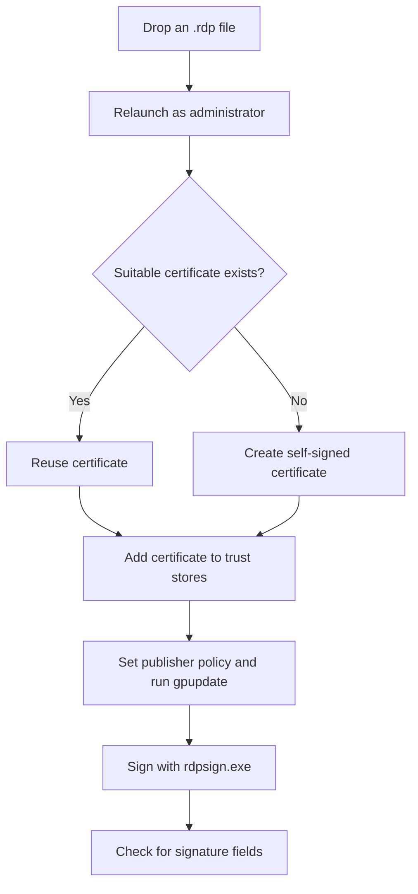

[**English**](README.md) | [Türkçe](README.tr.md)

# RDP Signer

**Sign Windows `.rdp` files by dragging them onto a single BAT/PowerShell script.** The script prepares a certificate, configures publisher trust on the local machine, and signs the file with `rdpsign.exe`.

  

> [!IMPORTANT]
> This script requests administrator privileges. It changes certificate stores for the current user and a machine-wide Group Policy registry value. Run it only on a computer you trust and with `.rdp` files whose contents you have reviewed.

## Quick start

1. Download the `.bat` file from this repository. You can rename it to `RDP-Signer.bat` without changing its contents.
2. Drag the `.rdp` file you want to sign onto the BAT file.
3. Approve the Windows administrator prompt.
4. Check the console for **İŞLEM BAŞARILI** (operation successful). The script updates the original `.rdp` file; it does not create a separate output file.

```text
Connection.rdp ── drag and drop ──▶ RDP-Signer.bat
                                     │
                                     └─▶ signs Connection.rdp in place
```

> [!TIP]
> Keep a backup of the `.rdp` file before signing. `rdpsign.exe` modifies it in place.

### Requirements

- Windows with Windows PowerShell, `New-SelfSignedCertificate`, `gpupdate.exe`, and `%SystemRoot%\System32\rdpsign.exe` available.
- Administrator privileges and permission to change the local Group Policy registry value.
- An existing `.rdp` file.

> On managed computers, a centrally applied Group Policy can overwrite the local value set by the script. In that environment, configure publisher trust through your organization's policy.

## How it works



| Step | What the script does |
| --- | --- |
| Input | Checks that the input exists and has an `.rdp` extension. |
| Elevation | Relaunches the BAT file using `RunAs`, passing the file path through a temporary file. |
| Certificate | Searches `Cert:\CurrentUser\My` for a certificate with subject `CN=<username> RDP`, a private key, and an unexpired validity period. Otherwise creates a SHA-256 code-signing certificate with an exportable private key. |
| Local trust | Adds the certificate to the current user's `TrustedPublisher` and `Root` stores. |
| Publisher policy | Computes SHA-256 over the certificate's DER data. Adds `sha256:<64 hexadecimal characters>` to `TrustedCertThumbprints` (`REG_SZ`) under `HKLM\SOFTWARE\Policies\Microsoft\Windows NT\Terminal Services`, then runs `gpupdate /force`. |
| Signing | Runs `%SystemRoot%\System32\rdpsign.exe /sha256 <certificate thumbprint> /v <file>`. |
| Final check | Checks the `.rdp` file for `signature:s:` and `signscope:s:` fields. |

The BAT file extracts its embedded PowerShell code into a temporary `.ps1` file, runs it, and deletes the temporary script on normal completion. There is no separate PowerShell file to download.

## Repeated runs and scope

- The script reuses a suitable certificate for the same user; otherwise it creates a new one.
- It does not add the same SHA-256 policy entry twice.
- It extracts only `sha256:` entries followed by 64 hexadecimal characters from the existing policy text, joins them with commas, and **rewrites** the value. Entries in other formats are not preserved. Back up the value first if it contains manually managed entries.
- The certificate stores belong to the **current user**, while the registry policy belongs to the **local machine**. Other computers or users do not automatically trust the generated certificate.
- The certificate is self-signed. This associates publisher information with the file; it does not establish an externally verified identity or authenticate the remote RDP server.

## Troubleshooting

| Message or symptom | What to check |
| --- | --- |
| `.rdp dosyasi degil` or `Dosya bulunamadi` | Drop an existing `.rdp` file onto the BAT file and check its path. |
| `Yonetici yetkisi alinamadi` | Check the UAC prompt and administrator privileges. |
| `rdpsign.exe bulunamadi` | Check whether `%SystemRoot%\System32\rdpsign.exe` exists. |
| `TrustedCertThumbprints ... yazilamadi` | Check administrator privileges and organizational policy restrictions. |
| `gpupdate /force hata verdi` | Inspect the `gpupdate` console output. The certificate and registry value may already have changed before this error. |
| `signature/signscope alanlari bulunamadi` | Inspect the `rdpsign.exe` output. The final check only tests for these fields; it does not cryptographically verify the signature. |
