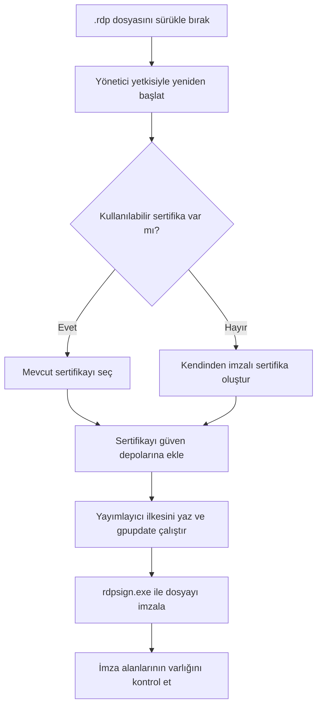

[English](README.md) | **Türkçe**

# RDP Signer

**Windows `.rdp` dosyalarını sürükle bırak yöntemiyle imzalayan tek dosyalık BAT/PowerShell aracı.** Sertifikayı hazırlar, yerel bilgisayarda yayımlayıcı güvenini ayarlar ve `rdpsign.exe` ile dosyayı imzalar.

  

> [!IMPORTANT]
> Betik yönetici yetkisi ister; geçerli kullanıcının sertifika depolarını ve bilgisayar genelindeki bir Grup İlkesi kayıt değerini değiştirir. İşlemi yalnızca güvendiğiniz bir makinede ve içeriğini kontrol ettiğiniz `.rdp` dosyalarında çalıştırın.

## Hızlı başlangıç

1. Depodaki `.bat` dosyasını indirin. İsterseniz adını `RDP-Signer.bat` olarak değiştirin; içerikte değişiklik gerekmez.
2. İmzalamak istediğiniz `.rdp` dosyasını BAT dosyasının üzerine sürükleyip bırakın.
3. Windows yönetici izni istediğinde onaylayın.
4. Açılan konsolda **İŞLEM BAŞARILI** çıktısını kontrol edin. İmzalanan dosya, sürüklediğiniz aynı `.rdp` dosyasıdır; ayrı bir çıktı dosyası oluşturulmaz.

```text
Baglanti.rdp  ── sürükle/bırak ──▶  RDP-Signer.bat
                                  │
                                  └─▶ aynı Baglanti.rdp dosyasına imza
```

> [!TIP]
> `.rdp` dosyanızın bir kopyasını önceden saklayın. `rdpsign.exe` dosyayı yerinde günceller.

### Gereksinimler

- Windows; Windows PowerShell, `New-SelfSignedCertificate`, `gpupdate.exe` ve `%SystemRoot%\System32\rdpsign.exe` kullanılabilir olmalı.
- Yönetici yetkisi ve yerel Grup İlkesi kayıt değerini değiştirme izni.
- İmzalanacak mevcut bir `.rdp` dosyası.

> Kurumsal cihazlarda merkezi Grup İlkesi, betiğin yazdığı yerel değerin üzerine yazabilir. Böyle bir ortamda yayımlayıcı güveni kurum politikasıyla yönetilmelidir.

## Nasıl çalışır?



| Aşama | Betiğin yaptığı işlem |
| --- | --- |
| Dosya kontrolü | Argümanın `.rdp` uzantılı ve mevcut bir dosya olduğunu doğrular. |
| Yetki yükseltme | BAT dosyasını `RunAs` ile yeniden başlatır; sürüklenen dosyanın yolunu geçici bir dosya üzerinden aktarır. |
| Sertifika | `Cert:\CurrentUser\My` içinde `CN=<kullanıcı adı> RDP` konulu, özel anahtarlı ve süresi dolmamış sertifikayı arar; bulamazsa SHA-256 kullanan, dışa aktarılabilir anahtarlı bir kod imzalama sertifikası oluşturur. |
| Yerel güven | Sertifikayı geçerli kullanıcının `TrustedPublisher` ve `Root` depolarına ekler. |
| Yayımlayıcı ilkesi | Sertifikanın DER verisinden SHA-256 özeti hesaplar ve `HKLM\SOFTWARE\Policies\Microsoft\Windows NT\Terminal Services` altındaki `TrustedCertThumbprints` (`REG_SZ`) değerine `sha256:<64 hex karakter>` biçiminde ekler. Ardından `gpupdate /force` çalıştırır. |
| İmzalama | `%SystemRoot%\System32\rdpsign.exe /sha256 <sertifika thumbprint> /v <dosya>` komutunu çalıştırır. |
| Son kontrol | `.rdp` içeriğinde `signature:s:` ve `signscope:s:` satırlarının bulunduğunu kontrol eder. |

BAT dosyası PowerShell bölümünü kendi içinden geçici bir `.ps1` dosyasına çıkarıp çalıştırır; normal bitişte bu geçici betiği siler. Ek bir PowerShell dosyası indirmeniz gerekmez.

## Yeniden çalıştırma ve kapsam

- Aynı kullanıcıda uygun sertifika varsa yeniden kullanılır; geçerli değilse yenisi oluşturulur.
- Aynı SHA-256 değeri ilkede varsa ikinci kez eklenmez.
- Betik ilkedeki mevcut metinden yalnızca `sha256:` ile başlayan 64 haneli hex değerleri toplar ve virgülle birleştirerek değeri **yeniden yazar**. Başka biçimdeki kayıtlar korunmaz. Kayıt değerinde elle yönetilen öğeler varsa önce yedekleyin.
- Sertifika depoları **geçerli kullanıcıya**, kayıt defteri ilkesi ise **yerel bilgisayara** aittir. Başka bir bilgisayar veya kullanıcı, bu betiğin oluşturduğu sertifikaya otomatik olarak güvenmez.
- Bu araç kendinden imzalı sertifika kullanır. İmza dosyanın yayımlayıcı bilgisini ilişkilendirir; dışarıdan doğrulanmış bir kimlik veya uzak RDP sunucusunun kimlik doğrulaması anlamına gelmez.

## Hata durumları

| Mesaj / belirti | Kontrol edin |
| --- | --- |
| `.rdp dosyasi degil` veya `Dosya bulunamadi` | Gerçek bir `.rdp` dosyasını BAT üzerine bırakın; dosyanın taşınmadığından emin olun. |
| `Yonetici yetkisi alinamadi` | UAC istemini ve hesabın yönetici yetkisini kontrol edin. |
| `rdpsign.exe bulunamadi` | Windows kurulumunda `%SystemRoot%\System32\rdpsign.exe` dosyasının varlığını kontrol edin. |
| `TrustedCertThumbprints ... yazilamadi` | Yönetici yetkisini ve kurumsal ilke kısıtlarını kontrol edin. |
| `gpupdate /force hata verdi` | Konsoldaki `gpupdate` çıktısını inceleyin; bu aşamada sertifika ve kayıt değeri daha önce değiştirilmiş olabilir. |
| `signature/signscope alanlari bulunamadi` | `rdpsign.exe` çıktısını inceleyin; son kontrol yalnızca bu alanların varlığını sınar, kriptografik imza doğrulaması yapmaz. |

## Açık kaynak olarak yayımlama

Depoya BAT dosyasını ve bu `README.md` dosyasını ekleyin. Kod için seçtiğiniz lisansı ayrı bir `LICENSE` dosyasında belirtin. Lisans eklenene kadar depoyu herkes okuyabilir, ancak kullanım ve yeniden dağıtım hakları açıkça verilmiş sayılmaz.
